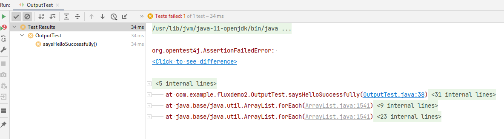

= Почему не нужно использовать `\r\n` в Java?

== Это не совсем правильно

`\r\n` -- перенос строки на Windows, что может быть неверно для других платформ, где запускается Java.

Возьмём, например, следующий тест:

[source,java]
----
public class OutputTest {
    private PrintStream originalOut; // 1
    private final ByteArrayOutputStream out = new ByteArrayOutputStream(); // 2
    private final PrintStream interceptingOut = new PrintStream(out); // 3

    @BeforeEach
    void setUp() {
        // 4
        originalOut = System.out;
        System.setOut(interceptingOut);
    }

    @AfterEach
    void tearDown() {
        // 5
        System.setOut(originalOut);
    }

    @Test
    void saysHelloSuccessfully() {
        sayHello();
        interceptingOut.flush();

        String actualOut = out.toString(StandardCharsets.UTF_8);

        assertEquals("Hello\r\n", actualOut);
    }

    private static void sayHello() {
        System.out.println("Hello");
    }
}
----

всё, что он делает -- проверяет, действительно ли в `System.out` попала строка `Hello`.

В тесте `saysHelloWorld`:

. Вызывается метод `sayHello`, печатающий в консоль строку `Hello`
. `actualOut` -- строка, отправленная в консоль, она была перехвачена через `interceptingOut`
. `assertEquals` -- сравнивает ожидаемый результат с полученным, ожидая `\r\n` в качестве разделителя

_Дополнительные пояснения:_

* (1) -- поле, в котором хранится оригинальный поток вывода
* (2) -- `OutputStream`, хранящий всё, что было отправлено в `System.out` во время исполнения теста
* (3) -- `PrintStream`, отправляющий всё, что отправлено в `System.out` в поле `out`
* (4) -- не забываем сохранить оригинальный `System.out`
* (5) -- не забываем восстановить оригинальный `System.out`

А теперь главный вопрос: **всегда ли этот тест будет проходить**?

Конечно же *_нет_*, ведь `\r\n` -- символ переноса на Windows.

На Linux тест падает:

== Как правильно?

Лучшее, что можно сделать с символами переноса строки -- *не использовать их явно*. Вместо этого:

. Если необходимо добавить перенос строки в вывод, использовать метод https://docs.oracle.com/en/java/javase/11/docs/api/java.base/java/io/PrintStream.html#println()[`println`] или его _перегрузки_
. Если всё-таки символ переноса строки необходим в контексте вывода, то вызвать метод https://docs.oracle.com/en/java/javase/11/docs/api/java.base/java/lang/System.html#lineSeparator()[`System.lineSeparator`] -- он вернет символ, подходящий для текущей платформы.

_Эти советы относятся только к выводу в консоль_

== Итог

* Символы перевода строки -- боль, т.к. они зависят от операционной системы
* Лучшее, что можно делать, -- не использовать их в явном виде, а полагаться на методы:
** https://docs.oracle.com/en/java/javase/11/docs/api/java.base/java/io/PrintStream.html#println()[`println`] или его _перегрузки_
** https://docs.oracle.com/en/java/javase/11/docs/api/java.base/java/lang/System.html#lineSeparator()[`System.lineSeparator`]
